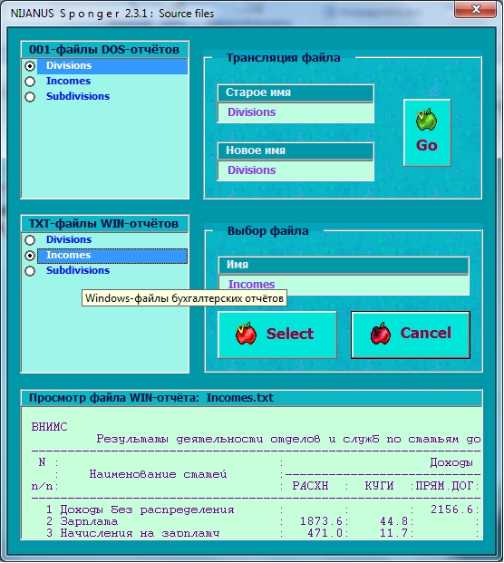
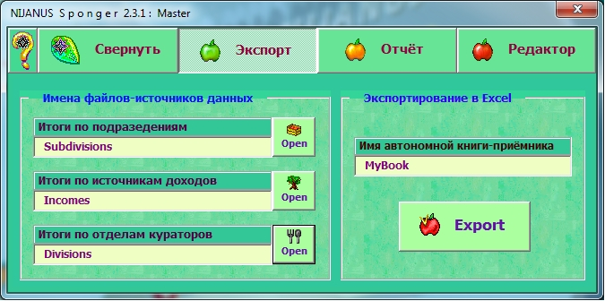
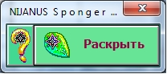
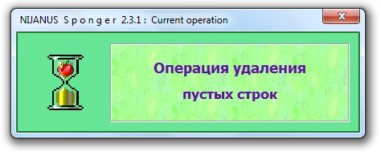
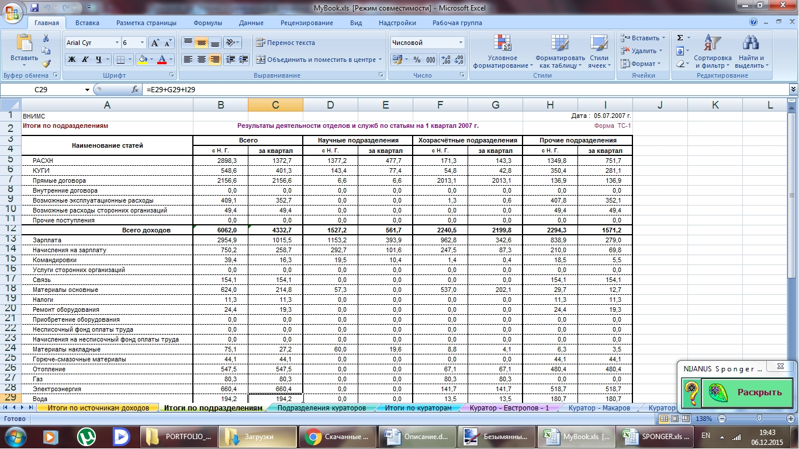
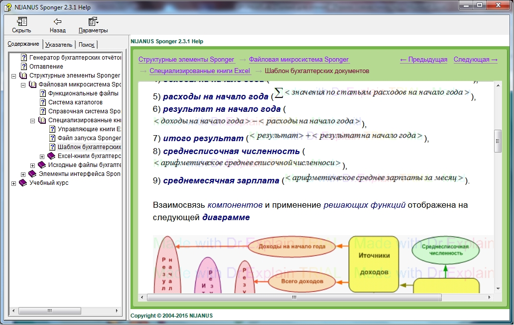
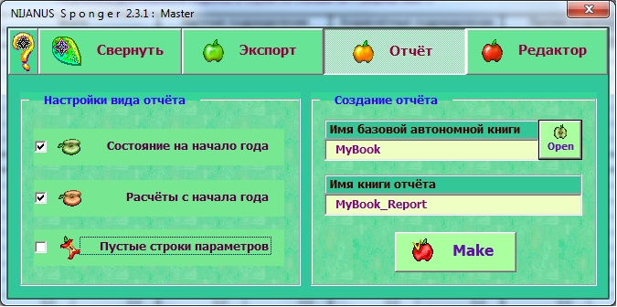
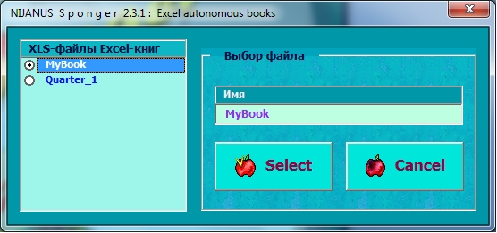
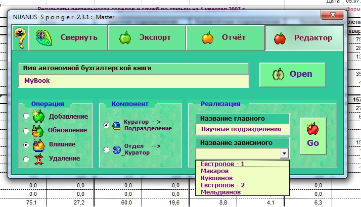

# Генератор бухгалтерских отчётов для планово-экономического отдела (Sponger)

## Цели проекта
1. **Масштаб разработки**: реализован ряд задач узкоспециализированного направления.
2. **Назначение**: подготовка бухгалтерских отчётов для планово-экономического отдела ГНУ ВНИМС и для других организаций, где можно выделить экономически замкнутые процессы относительно подразделений, кураторов, отделов, источников доходов и статей расходов.
3. **Основная функция**: перенос данных в автономные книги Excel из текстовых документов, созданных средствами бухгалтерской программы, обращённой к локальной базе данных в системе DOS.
4. **Другие возможности**:
	- трансляция файлов из формата с расширением ".001" в ".txt";
	- создание отчётов на базе автономных бухгалтерских книг Excel;
	- редактирование существующих автономных книг.
5. **Интерфейс**: лёгкость восприятия, компактность и согласованная цветовая гамма.

## Средства разработки
- **Язык программирования**: Microsoft Visual Basic for Application.
- **Среда разработки**: Microsoft Excel.
- **Программа для создания справочной системы текущей версии**: Dr.Explain.
- **Система создания инсталлятора для Windows**: Inno Setup.

## Описание программного пакета
1. Файлы "ARIAL.TTF", "BOSANOVA.TTF" и "TAHOMA.TTF" шрифтов "Arial", "a_BosaNova" и "Tahoma" в системной папке локализации шрифтов.
2. "Sponger.xls" - книга Microsoft Excel, содержащая данную программу.
3. Каталоги, необходимые для функционирования данной программы, которые не следует переименовывать: "001_DOS", "001_TXT_Windows", "Autonomus", "Reports", "Sources", "TXT_Windows", "Uninstall" и "WorkBooks".
4. "Sponger_Templet.xlt" - базовый шаблон для создания автономных книг (не стоит изменять название).
5. Примеры одноименных исходных файлов "Curators.*", "Divisions.*", "Incomes.*", "Subdivisions.*" в папках "001_DOS", "001_TXT_Windows" и "TXT_Windows".
6. Пример автономной книги "Quarter_1.xls".
7. Пример отчёта по автономной книге - "Quarter_1_Report.xls".
8. Файлы справки.
9. Файлы деинсталлятора.

**ВНИМАНИЕ!** Данная программа считывает инфорацию только из подкаталогов "001_DOS", "001_TXT_Windows", "Autonomus" и "TXT_Windows", а записывает - исключительно в папки "001_TXT_Windows", "Autonomus", "Reports" и "TXT_Windows", следовательно при увеличении количества создаваемых ею файлов уменьшается свободное дисковое пространство, поэтому при активном использовании программы лучше всего не перегружать ею директорию "Program Files".

## Запуск программы
1. Сделать макросы Microsoft Excel, на которых построена данная разработка, доступными.
    1. Запустить Microsoft Excel.
    2. Закрыть все открытые рабочие книги.
    3. Выбрать пункты главного меню "Сервис\Макрос\Безопасность...".
    4. В открывшемся диалоговом окне "Безопасность" перейти на вкладку "Уровень безопасности".
    5. Установить низкую или среднюю (предпочтительнее) безопасность.
    6. Подтвердить выбранный режим нажатием кнопки "ОК".
2. Открыть Sponger.
3. Активизировать макросы Microsoft Excel в открывшейся книге "Sponger.xls" (она содержит единственный лист - главную страницу программы), нажав кнопку "Не отключать макросы" в появившемся диалоговом окне "Предупреждение системы безопасности".
4. Вызвать форму мастера-помощника сопровождающую работу программы, кликнув по надписи "Call the Master".

## Статус проекта
Проект завершён.

## Контакты
Котова Екатерина Александровна,
e-mail: katekotova_86@mail.ru